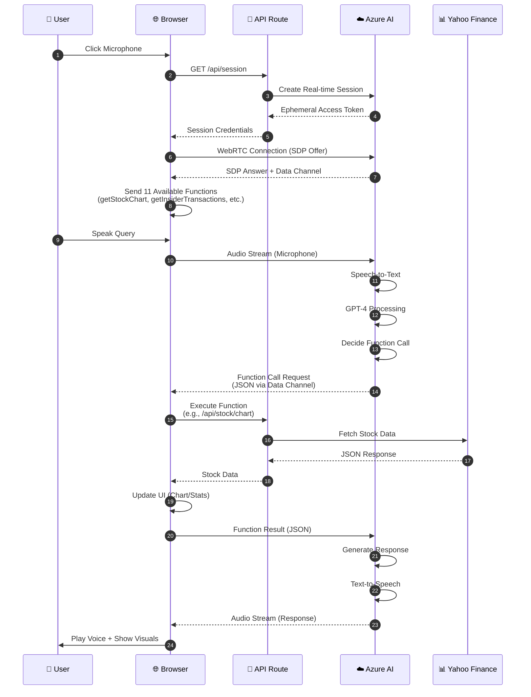

# 🎙️ Portfolio AI Assistant

<div align="center">


**A voice-enabled AI financial assistant powered by Azure OpenAI's real-time API**

[Features](#-features) • [Architecture](#-architecture) • [Getting Started](#-getting-started) • [API Reference](#-api-reference) • [Deployment](#-deployment)

</div>

---

## 📋 Table of Contents

- [Overview](#overview)
- [Features](#-features)
- [Architecture](#-architecture)
- [Tech Stack](#-tech-stack)
- [Getting Started](#-getting-started)
- [Project Structure](#-project-structure)
- [API Reference](#-api-reference)
- [Voice Commands](#-voice-commands)
- [Development](#-development)
- [Deployment](#-deployment)
- [Contributing](#-contributing)
- [License](#-license)

---

## Overview

Portfolio AI Assistant is a cutting-edge web application that combines voice interaction with real-time financial data analysis. Built with Next.js 15 and powered by Azure OpenAI's GPT-4 real-time API, it provides an intuitive, hands-free way to explore stock markets, analyze companies, and track market trends.

The application leverages **WebRTC** for low-latency voice streaming, **function calling** for dynamic data retrieval, and **ApexCharts** for interactive visualizations—all wrapped in a modern, responsive UI with dark/light theme support.

### 🎯 Key Highlights

- **🎙️ Natural Voice Interaction**: Speak naturally to request stock data, compare companies, and get insights
- **📊 11 Data Visualization Types**: Charts, profiles, statistics, analyst analysis, recommendations, earnings calendar, trending tickers, insider transactions, balance sheets, income statements, and cash flow statements
- **🔄 Content History**: Navigate through past queries with arrow buttons, dot indicators, or swipe gestures
- **💾 Conversation Persistence**: Chat history saved across sessions for context continuity
- **🔍 Tool Call Tracking**: Transparent view of all AI function calls and API requests
- **⚡ Real-time Data**: All stock data fetched on-demand from Yahoo Finance via RapidAPI
- **🏗️ Modular Architecture**: Clean hooks-based state management with centralized types
- **🌓 Theme Support**: Seamless dark/light mode switching
- **📱 Responsive Design**: Works beautifully on desktop, tablet, and mobile devices

---

## ✨ Features

### Voice-Controlled AI Assistant

- **WebRTC-Based Audio Streaming**: Direct peer-to-peer connection with Azure OpenAI for minimal latency
- **Natural Language Processing**: Powered by GPT-4 with real-time speech-to-text and text-to-speech
- **Function Calling**: AI dynamically calls appropriate functions based on user queries
- **Conversation Memory**: Maintains context across the session for natural follow-up questions

### Financial Data Analysis (11 Content Types)

#### 1. 📈 Interactive Stock Charts
- **Three View Modes**:
  - **Price**: Absolute stock price over time
  - **Percent**: Percentage change from start date
  - **Relative**: Indexed performance (normalized to 100)
- **Multi-Stock Comparison**: Compare up to multiple stocks on the same chart
- **Event Annotations**: Dividends, stock splits, and earnings marked on timeline
- **Interactive Features**: Zoom, pan, crosshair, and export options

#### 2. 🏢 Company Profiles
- Sector, industry, and company description
- Leadership information (CEO, executives)
- Employee count and headquarters location
- Company website link
- Full business summary

#### 3. 📊 Key Financial Statistics
- **Valuation Metrics**: Market cap, enterprise value, P/E ratio, book value, EPS
- **Trading & Risk**: Beta, shares outstanding, institutional holdings
- **Performance**: Profit margins, revenue growth, operating ratios

#### 4. 📝 Analyst Analysis
- Comprehensive analyst recommendations
- Earnings estimates and actuals
- Price targets (current, high, low, average)
- Upgrade/downgrade history
- Analyst consensus ratings

#### 5. 📉 Recommendation Trends
- Historical Buy/Hold/Sell ratings over time
- Shows current month, -1 month, -2 months, -3 months
- Visual bar charts of analyst sentiment changes
- Strong buy, buy, hold, sell, strong sell breakdowns

#### 6. 📅 Earnings Calendar
- Upcoming and recent earnings events
- EPS estimates vs. actuals
- Surprise percentages
- Earnings date and time
- Filterable by date range and region

#### 7. 🔥 Trending Tickers
- Real-time trending stocks with high activity
- Grid layout with individual ticker cards
- Market state badges (Open, Closed, Pre-Market, After Hours)
- Price, change, and percentage information
- **Click-to-View**: Tap any ticker to instantly load its chart
- Multi-region support (US, GB, AU, IN, etc.)

#### 8. 👔 Insider Transactions **(NEW)**
- Track insider buying and selling activity
- Transaction details: date, type (purchase/sale/grant), shares, value
- Insider information: name, title, ownership after transaction
- Net buying/selling insights over 6 months
- Color-coded indicators for purchases (green) and sales (red)
- Pattern detection for insider confidence signals

#### 9. 📋 Balance Sheet **(NEW)**
- Complete balance sheet visualization
- **Assets**: Total assets, current assets, cash, receivables, inventory
- **Liabilities**: Total liabilities, current liabilities, debt, payables
- **Shareholders' Equity**: Total equity, retained earnings, common stock
- Annual and quarterly data with trend analysis
- Key ratios: Current ratio, debt-to-equity, book value per share

#### 10. 💰 Income Statement **(NEW)**
- Comprehensive income statement display
- **Revenue**: Total revenue with growth trends
- **Expenses**: Cost of revenue, operating expenses, R&D, SG&A
- **Profitability**: Gross profit, operating income, net income
- **Per-Share Metrics**: EPS (basic and diluted)
- **Margins**: Gross margin, operating margin, profit margin
- Visual charts for revenue and profit trends

#### 11. 💵 Cash Flow Statement **(NEW)**
- Detailed cash flow analysis
- **Operating Cash Flow**: Cash from operations, working capital changes
- **Investing Cash Flow**: Capital expenditures, acquisitions, investments
- **Financing Cash Flow**: Debt, dividends, stock buybacks
- **Free Cash Flow**: Operating cash flow minus CapEx
- Cash flow quality metrics and capital allocation patterns

### User Experience Features

- **Conversation Persistence**:
  - Chat history saved to markdown file
  - Last 30 messages loaded on app start
  - Context maintained across sessions
  - Clear history option available

- **Content History Navigation**:
  - Previous/Next arrow buttons
  - Dot indicators showing position in history (11 content types supported)
  - Swipe gestures on touch devices
  - Smooth slide animations (left/right)

- **Tool Call Tracking**:
  - Expandable panel showing all AI function calls
  - Parameters, results, and timestamps for each call
  - API endpoint details and response status
  - Color-coded success/error indicators
  - Transparency for debugging and auditing

- **Example Prompts**: Animated typewriter-style example queries to guide users

- **Toast Notifications**: Non-intrusive alerts for errors, loading states, and confirmations

- **Responsive Information Panel**: Shows detailed stock metrics for the selected ticker

---

## 🏗️ Architecture

### High-Level System Architecture

```mermaid
graph TB
    User[👤 User Browser] --> UI[⚛️ Next.js Frontend<br/>React 19 + TypeScript]
    UI --> API[🔧 Next.js API Routes<br/>Serverless Functions]

    API --> Azure[☁️ Azure OpenAI<br/>Real-time API<br/>GPT-4 + Speech]
    API --> Yahoo[📊 Yahoo Finance API<br/>via RapidAPI]

    Azure --> |WebRTC<br/>Audio + Data Channel| UI
    Yahoo --> |JSON<br/>Stock Data| API

    UI --> Charts[📈 ApexCharts]
    UI --> State[🔄 React State<br/>Hooks]

    style User fill:#e1f5ff
    style UI fill:#61dafb
    style API fill:#000000
    style Azure fill:#412991
    style Yahoo fill:#720e9e
```



### Voice Assistant WebRTC Flow



### Data Flow Architecture

```mermaid
graph LR
    A[🎤 Voice Input] --> B[📡 WebRTC]
    B --> C[🎯 Azure STT]
    C --> D[🤖 GPT-4<br/>Function Calling]

    D --> E{Function<br/>Type?}

    E -->|getStockChart| F1[/api/stock/chart]
    E -->|getStockProfile| F2[/api/stock/profile]
    E -->|getStockStatistics| F3[/api/stock/statistics]
    E -->|getStockAnalysis| F4[/api/stock/analysis]
    E -->|getRecommendationTrend| F5[/api/stock/recommendation-trend]
    E -->|getEarningsCalendar| F6[/api/stock/earnings-calendar]
    E -->|getTrendingTickers| F7[/api/market/trending-tickers]
    E -->|getInsiderTransactions| F8[/api/stock/insider-transactions]
    E -->|getBalanceSheet| F9[/api/stock/financials]
    E -->|getIncomeStatement| F10[/api/stock/financials]
    E -->|getCashFlow| F11[/api/stock/financials]

    F1 & F2 & F3 & F4 & F5 & F6 & F7 & F8 & F9 & F10 & F11 --> G[📊 Yahoo Finance<br/>RapidAPI]

    G --> H[📄 JSON Response]
    H --> I[⚛️ React State Update]
    I --> J[🎨 UI Re-render]

    H --> D
    D --> K[🔊 Azure TTS]
    K --> L[🔈 Audio Output]

    style A fill:#ff9999
    style L fill:#99ff99
```

### Component Architecture

```mermaid
graph TD
    Root["📄 app/page.tsx<br/>(Main Orchestrator)"]

    Root --> Chart["📈 StockChart<br/>(ApexCharts)"]
    Root --> Info["ℹ️ StockInfoPanel<br/>(Price, Volume, etc.)"]
    Root --> Profile["🏢 StockProfileCard<br/>(Company Info)"]
    Root --> Stats["📊 StockStatisticsCard<br/>(Financial Metrics)"]
    Root --> Analysis["📝 StockAnalysisCard<br/>(Analyst Recs)"]
    Root --> Recs["📉 RecommendationTrendCard<br/>(Historical Ratings)"]
    Root --> Earnings["📅 EarningsCalendarCard<br/>(Earnings Events)"]
    Root --> Trending["🔥 TrendingTickersCard<br/>(Hot Stocks Grid)"]
    Root --> Insider["👔 InsiderTransactionsCard<br/>(Insider Trading)"]
    Root --> Balance["📋 BalanceSheetCard<br/>(Assets & Liabilities)"]
    Root --> Income["💰 IncomeStatementCard<br/>(Revenue & Profit)"]
    Root --> CashFlow["💵 CashFlowCard<br/>(Cash Flows)"]

    Root --> Audio["🎙️ AudioSphereVisualizer<br/>(Mic Control)"]
    Root --> Theme["🌓 ThemeToggle<br/>(Dark/Light)"]
    Root --> Prompts["⌨️ TypewriterBadges<br/>(Example Queries)"]
    Root --> ToolPanel["🔍 ToolCallsPanel<br/>(Function Tracking)"]

    Root --> History["🔄 Content History<br/>(11 Content Types)"]

    style Root fill:#61dafb
    style Chart fill:#ffd966
    style Trending fill:#ff6b6b
```



---

## 🛠️ Tech Stack

### Frontend

| Technology | Purpose |
|------------|---------|
| **Next.js 15.2** | Full-stack React framework with App Router |
| **React 19** | UI component library with hooks |
| **TypeScript 5** | Type-safe JavaScript |
| **Tailwind CSS 3.4** | Utility-first CSS framework |
| **Shadcn UI** | Pre-built accessible components |
| **Radix UI** | Low-level accessible primitives |
| **ApexCharts** | Interactive charting library |
| **Recharts 2.15** | Declarative charting (secondary) |
| **Lucide React** | Icon library |
| **next-themes** | Dark/light mode management |
| **Sonner** | Toast notification system |

### Backend & APIs

| Technology | Purpose |
|------------|---------|
| **Next.js API Routes** | Serverless backend functions |
| **Azure OpenAI** | GPT-4 real-time API with function calling |
| **WebRTC** | Real-time audio/data streaming |
| **Yahoo Finance API** | Stock market data (via RapidAPI) |
| **RapidAPI** | API marketplace and authentication |

### Additional Libraries

- **react-hook-form** + **zod**: Form validation
- **react-markdown**: Markdown rendering
- **class-variance-authority**: Component variant styling
- **date-fns**: Date manipulation

---

## 🚀 Getting Started

### Prerequisites

- **Node.js** 18.x or later
- **pnpm** (recommended) or npm/yarn
- **Azure OpenAI** account with real-time API access
- **RapidAPI** account with Yahoo Finance subscription

### Installation

1. **Clone the repository**

```bash
git clone https://github.com/yourusername/portfolio-ai-nxt-3.git
cd portfolio-ai-nxt-3
```

2. **Install dependencies**

```bash
pnpm install
# or
npm install
# or
yarn install
```

3. **Set up environment variables**

Create a `.env.local` file in the root directory:

```env
# RapidAPI Key for Yahoo Finance API
RAPID_API_KEY=your_rapidapi_key_here

# Azure OpenAI API Key for voice assistant
OPENAI_API_KEY=your_azure_openai_api_key_here
```

**How to get API keys:**

- **RapidAPI Key**:
  1. Sign up at [RapidAPI](https://rapidapi.com/)
  2. Subscribe to [Yahoo Finance API](https://rapidapi.com/sparior/api/yahoo-finance15)
  3. Copy your API key from the dashboard

- **Azure OpenAI Key**:
  1. Create an [Azure account](https://azure.microsoft.com/)
  2. Create an Azure OpenAI resource in East US 2 region
  3. Deploy the `gpt-realtime` model (or `gpt-4o-realtime-preview`)
  4. Copy the API key from Keys and Endpoint section
  5. **Important**: Update the endpoint URL in `app/api/session/route.ts` if not using `voiceaistudio9329552017.openai.azure.com`

4. **Run the development server**

```bash
pnpm dev
```

5. **Open your browser**

Navigate to [http://localhost:3000](http://localhost:3000)

### First-Time Setup

1. **Grant microphone permissions** when prompted
2. **Click the microphone sphere** to start the voice assistant
3. **Try an example prompt** or speak naturally:
   - "Show me Apple's stock chart"
   - "What are the trending stocks today?"
   - "Compare Tesla with Ford and GM"

---

## 📁 Project Structure

```
portfolio-ai-nxt-3/
│
├── app/                          # Next.js App Router
│   ├── api/                      # Backend API routes (serverless)
│   │   ├── conversation/         # Conversation persistence (NEW)
│   │   │   ├── save/             # POST save message
│   │   │   ├── load/             # GET load history
│   │   │   └── clear/            # POST clear history
│   │   ├── market/
│   │   │   └── trending-tickers/ # GET trending stocks
│   │   ├── stock/
│   │   │   ├── chart/            # GET stock price history
│   │   │   ├── profile/          # GET company profile
│   │   │   ├── statistics/       # GET financial statistics
│   │   │   ├── analysis/         # GET analyst analysis
│   │   │   ├── recommendation-trend/  # GET recommendation history
│   │   │   ├── earnings-calendar/     # GET earnings events
│   │   │   ├── insider-transactions/  # GET insider trading data (NEW)
│   │   │   └── financials/       # GET financial statements (NEW)
│   │   ├── keys/                 # GET API keys (client-side)
│   │   └── session/              # GET Azure session token
│   │
│   ├── layout.tsx                # Root layout with providers
│   ├── page.tsx                  # Main app page (UI orchestrator)
│   └── globals.css               # Global styles + Tailwind imports
│
├── components/                   # React components
│   ├── ui/                       # Shadcn UI primitives
│   │   ├── card.tsx
│   │   ├── button.tsx
│   │   ├── dialog.tsx
│   │   ├── toast.tsx
│   │   ├── audio-sphere-visualizer.tsx
│   │   ├── typewriter-badges.tsx
│   │   └── ...
│   │
│   ├── stock-chart.tsx           # ApexCharts stock visualization
│   ├── stock-info-panel.tsx      # Stock details sidebar
│   ├── stock-profile-card.tsx    # Company profile display
│   ├── stock-statistics-card.tsx # Financial statistics
│   ├── stock-analysis-card.tsx   # Analyst analysis
│   ├── stock-recommendation-trend-card.tsx  # Recommendation trends
│   ├── stock-earnings-calendar-card.tsx     # Earnings calendar
│   ├── trending-tickers-card.tsx # Trending stocks grid
│   ├── stock-insider-transactions-card.tsx  # Insider trading (NEW)
│   ├── stock-balance-sheet-card.tsx         # Balance sheet (NEW)
│   ├── stock-income-statement-card.tsx      # Income statement (NEW)
│   ├── stock-cash-flow-card.tsx             # Cash flow statement (NEW)
│   ├── tool-calls-panel.tsx      # Function call tracking (NEW)
│   ├── api-call-details.tsx      # API metadata display (NEW)
│   ├── theme-toggle.tsx          # Dark/light mode button
│   └── theme-provider.tsx        # Theme context provider
│
├── hooks/                        # Custom React hooks (9 total - NEW)
│   ├── use-voice-session.ts      # Voice/WebRTC state
│   ├── use-stock-data.ts         # Stock data state (11 types)
│   ├── use-stock-api.ts          # API fetch functions
│   ├── use-content-history.ts    # Navigation history
│   ├── use-conversation.ts       # Conversation persistence
│   ├── use-function-calls.ts     # Function call tracking
│   ├── use-ui-state.ts           # UI state management
│   ├── use-toast.ts              # Toast notifications
│   └── use-mobile.tsx            # Mobile detection
│
├── lib/                          # Utility functions
│   ├── webrtc-helpers.ts         # WebRTC connection utilities
│   ├── voice-tools-config.ts     # AI function definitions (NEW)
│   ├── constants.ts              # Example prompts (NEW)
│   └── utils.ts                  # General utilities (cn, etc.)
│
├── types/                        # Centralized type definitions (NEW)
│   ├── api.ts                    # API response types
│   ├── chart.ts                  # Chart data structures
│   ├── function-calls.ts         # Function call types
│   ├── history.ts                # History item types (11 content types)
│   ├── voice-session.ts          # WebRTC types
│   └── index.ts                  # Barrel export
│
├── data/                         # Data storage
│   └── session_history.md        # Conversation history
│
├── public/                       # Static assets
│
├── .env.local                    # Environment variables (gitignored)
├── next.config.mjs               # Next.js configuration
├── tailwind.config.ts            # Tailwind CSS configuration
├── tsconfig.json                 # TypeScript configuration
├── package.json                  # Dependencies and scripts
└── README.md                     # This file
```

---

## 📚 API Reference

### Stock Data Endpoints

#### 1. GET `/api/stock/chart`

Fetch historical stock price data with optional comparisons.

**Query Parameters:**
- `symbol` (required): Stock ticker symbol (e.g., "AAPL")
- `region` (optional): Region code (default: "US")
- `comparisons` (optional): Comma-separated symbols for comparison (e.g., "TSLA,MSFT")
- `range` (optional): Time range - "1d", "5d", "1mo", "3mo", "6mo", "1y", "2y", "5y", "10y", "ytd"
- `interval` (optional): Data interval - "1m", "5m", "15m", "1h", "1d", "1wk", "1mo"
- `events` (optional): Events to include - "div,split,earn"

**Response:**
```json
{
  "success": true,
  "chartData": {
    "chart": {
      "result": [{
        "meta": { "symbol": "AAPL", "range": "1mo" },
        "timestamp": [1234567890, ...],
        "indicators": { "quote": [...], "adjclose": [...] },
        "events": { "dividends": {...}, "splits": {...} }
      }]
    }
  }
}
```

#### 2. GET `/api/stock/profile`

Fetch company profile information.

**Query Parameters:**
- `symbol` (required): Stock ticker symbol
- `region` (optional): Region code

**Response:**
```json
{
  "success": true,
  "profileData": {
    "summaryProfile": {
      "sector": "Technology",
      "industry": "Consumer Electronics",
      "longBusinessSummary": "...",
      "website": "https://www.apple.com",
      "employees": 164000
    }
  }
}
```

#### 3. GET `/api/stock/statistics`

Fetch key financial statistics.

**Query Parameters:**
- `symbol` (required): Stock ticker symbol
- `region` (optional): Region code

**Response:**
```json
{
  "success": true,
  "statisticsData": {
    "defaultKeyStatistics": {
      "enterpriseValue": { "raw": 3000000000000 },
      "trailingPE": { "raw": 28.5 },
      "beta": { "raw": 1.2 }
    }
  }
}
```

#### 4. GET `/api/stock/analysis`

Fetch comprehensive analyst analysis.

**Query Parameters:**
- `symbol` (required): Stock ticker symbol
- `region` (optional): Region code

**Response:**
```json
{
  "success": true,
  "analysisData": {
    "recommendationTrend": [...],
    "earningsEstimate": [...],
    "targetPrice": { "current": 180, "high": 250, "low": 120 }
  }
}
```

#### 5. GET `/api/stock/recommendation-trend`

Fetch historical analyst recommendation trends.

**Query Parameters:**
- `symbol` (required): Stock ticker symbol
- `region` (optional): Region code

**Response:**
```json
{
  "success": true,
  "recommendationTrendData": {
    "recommendationTrend": [
      {
        "period": "0m",
        "strongBuy": 15,
        "buy": 20,
        "hold": 10,
        "sell": 2,
        "strongSell": 0
      }
    ]
  }
}
```

#### 6. GET `/api/stock/earnings-calendar`

Fetch earnings calendar events.

**Query Parameters:**
- `period1` (optional): Start date (YYYY-MM-DD)
- `period2` (optional): End date (YYYY-MM-DD)
- `region` (optional): Region code (default: "US")
- `size` (optional): Number of results (default: 100, max: 250)
- `offset` (optional): Pagination offset
- `sortField` (optional): Sort by "startdatetime" or "companyshortname"
- `sortType` (optional): "ASC" or "DESC"

**Response:**
```json
{
  "success": true,
  "earningsCalendarData": {
    "earnings": [
      {
        "ticker": "AAPL",
        "companyshortname": "Apple Inc.",
        "startdatetime": "2024-10-25T16:30:00",
        "epsestimate": 1.25,
        "epsactual": 1.30,
        "surprisepercent": 4.0
      }
    ]
  }
}
```

#### 7. GET `/api/market/trending-tickers`

Fetch currently trending stock tickers.

**Query Parameters:**
- `region` (optional): Region code (default: "US") - Options: US, GB, AU, IN, etc.
- `lang` (optional): Language code (default: "en-US")

**Response:**
```json
{
  "success": true,
  "trendingTickersData": {
    "finance": {
      "result": [{
        "quotes": [
          {
            "symbol": "NVDA",
            "shortName": "NVIDIA Corporation",
            "regularMarketPrice": 850.50,
            "regularMarketChange": 15.25,
            "regularMarketChangePercent": 1.83,
            "marketState": "REGULAR",
            "exchange": "NasdaqGS"
          }
        ]
      }]
    }
  }
}
```

#### 8. GET `/api/stock/insider-transactions` **(NEW)**

Fetch insider trading activity for a company.

**Query Parameters:**
- `symbol` (required): Stock ticker symbol
- `region` (optional): Region code (default: "US")

**Response:**
```json
{
  "success": true,
  "insiderTransactionsData": {
    "insiderTransactions": [
      {
        "filerName": "Tim Cook",
        "filerRelation": "Chief Executive Officer",
        "transactionDate": "2024-10-15",
        "transactionType": "Sale",
        "shares": 50000,
        "value": 8500000,
        "ownershipAfter": 3200000
      }
    ]
  }
}
```

#### 9. GET `/api/stock/financials` **(NEW)**

Fetch comprehensive financial statements (balance sheet, income statement, cash flow).

**Query Parameters:**
- `symbol` (required): Stock ticker symbol
- `region` (optional): Region code (default: "US")

**Response:**
```json
{
  "success": true,
  "financialsData": {
    "balanceSheet": {
      "annual": [...],
      "quarterly": [...]
    },
    "incomeStatement": {
      "annual": [...],
      "quarterly": [...]
    },
    "cashFlow": {
      "annual": [...],
      "quarterly": [...]
    }
  }
}
```

### Conversation Endpoints **(NEW)**

#### POST `/api/conversation/save`

Save a conversation message to history.

**Request Body:**
```json
{
  "role": "user",
  "content": "Show me Apple's stock chart"
}
```

**Response:**
```json
{
  "success": true,
  "message": "Message saved"
}
```

#### GET `/api/conversation/load`

Load conversation history (last 30 messages).

**Response:**
```json
{
  "success": true,
  "messages": [
    {
      "role": "user",
      "content": "Show me Apple's stock chart"
    },
    {
      "role": "assistant",
      "content": "I'll fetch Apple's stock chart for you..."
    }
  ]
}
```

#### POST `/api/conversation/clear`

Clear all conversation history.

**Response:**
```json
{
  "success": true,
  "message": "Conversation history cleared"
}
```

### Voice Assistant Endpoints

#### GET `/api/session`

Create a new Azure OpenAI real-time session.

**Query Parameters:**
- `timezone` (optional): User's timezone (e.g., "America/New_York")

**Response:**
```json
{
  "id": "session-xyz",
  "client_secret": {
    "value": "ephemeral_token_here",
    "expires_at": 1234567890
  },
  "model": "gpt-realtime",
  "voice": "verse"
}
```

**Note:** The session endpoint creates a connection to Azure OpenAI's real-time API at `voiceaistudio9329552017.openai.azure.com`. 11 AI functions are automatically configured for stock data retrieval.

#### GET `/api/keys`

Get client-side API keys (RapidAPI).

**Response:**
```json
{
  "rapidApiKey": "your_rapidapi_key"
}
```

---

## 🎙️ Voice Commands

The AI assistant understands natural language. Here are example commands:

### Stock Charts
- "Show me Apple's stock chart"
- "How did Tesla perform over the last 6 months?"
- "Display Amazon's price over the past year"
- "Compare Tesla to Ford and GM"
- "Show me NVDA versus AMD for the last 3 months"

### Company Information
- "Tell me about NVIDIA's company profile"
- "What does Microsoft do?"
- "Show me Google's company information"

### Financial Statistics
- "What are the key stats for Apple?"
- "Show me Microsoft's financial metrics"
- "What's Tesla's P/E ratio?"

### Analyst Analysis
- "Show me analyst recommendations for Tesla"
- "What do analysts say about NVIDIA?"
- "What are the price targets for Apple?"

### Recommendation Trends
- "What's the recommendation trend for Amazon?"
- "Show me how analyst ratings have changed for Google"
- "Historical recommendations for Microsoft"

### Earnings Calendar
- "Show me upcoming earnings"
- "What earnings are next week?"
- "Earnings calendar for this month"

### Trending Stocks
- "What are the trending stocks today?"
- "Show me what's hot in the market"
- "What stocks are trending right now?"

### Insider Transactions **(NEW)**
- "Show me insider trading for Apple"
- "Has anyone at NVIDIA been buying or selling stock?"
- "What are the recent insider transactions for Tesla?"

### Financial Statements **(NEW)**
- "Show me Apple's balance sheet"
- "What's Tesla's income statement?"
- "Display Microsoft's cash flow statement"
- "How much cash does Google have?"

### Follow-up Questions
The assistant maintains context across sessions with conversation persistence:
- "What about Google?" (after asking about Apple)
- "How about the last year?" (to change time range)
- "Add Ford to the comparison" (to compare more stocks)
- "Now show the balance sheet" (after viewing a chart)

---

## 💻 Development

### Available Scripts

```bash
# Development server (hot reload)
pnpm dev

# Production build
pnpm build

# Start production server
pnpm start

# Run ESLint
pnpm lint
```

### Environment Variables

| Variable | Required | Description |
|----------|----------|-------------|
| `RAPID_API_KEY` | Yes | RapidAPI key for Yahoo Finance API |
| `OPENAI_API_KEY` | Yes | Azure OpenAI API key for voice assistant |

### Key Files to Know

- **`app/page.tsx`**: Main UI orchestrator - composes hooks and handles rendering
- **`app/api/session/route.ts`**: Creates Azure AI sessions with system instructions
- **`hooks/use-voice-session.ts`**: WebRTC state management
- **`hooks/use-stock-data.ts`**: Stock data state (11 content types)
- **`hooks/use-stock-api.ts`**: Centralized API fetch functions
- **`lib/voice-tools-config.ts`**: 11 AI function definitions
- **`types/*`**: Centralized TypeScript type definitions
- **`components/stock-chart.tsx`**: ApexCharts configuration and rendering
- **`tailwind.config.ts`**: Theme colors and dark mode configuration

### Common Development Tasks

#### Adding a New Stock Function

With the modular architecture:

1. **Add function definition** in `lib/voice-tools-config.ts`
2. **Create API route** in `app/api/stock/[function-name]/route.ts`
3. **Add fetch function** in `hooks/use-stock-api.ts`
4. **Add state** in `hooks/use-stock-data.ts`
5. **Add types** in `types/api.ts` and `types/history.ts`
6. **Create component** in `components/stock-[name]-card.tsx`
7. **Update main page** rendering logic in `app/page.tsx`

#### Modifying AI Personality

Edit system instructions in `app/api/session/route.ts` (around line 33+)

#### Debugging Voice Assistant

1. Open browser DevTools Console
2. Look for WebRTC connection logs
3. Check data channel messages (JSON events)
4. Monitor function call requests and responses
5. **Use Tool Calls Panel** in UI for real-time function call inspection
6. **Check conversation history** in `/data/session_history.md`

---

## 🌐 Deployment

### Deploy to Vercel (Recommended)

[](https://vercel.com/new/clone?repository-url=https://github.com/yourusername/portfolio-ai-nxt-3)

1. **Push to GitHub**

```bash
git add .
git commit -m "Initial commit"
git push origin main
```

2. **Import to Vercel**
   - Go to [vercel.com](https://vercel.com)
   - Click "Import Project"
   - Select your GitHub repository
   - Configure environment variables:
     - `RAPID_API_KEY`
     - `OPENAI_API_KEY`

3. **Deploy**
   - Vercel will automatically build and deploy
   - Your app will be live at `your-project.vercel.app`

### Environment Variables in Production

Make sure to set these in your hosting platform:

```env
RAPID_API_KEY=your_rapidapi_key
OPENAI_API_KEY=your_azure_openai_key
```

### Azure Configuration Requirements

- **Endpoint**: `voiceaistudio9329552017.openai.azure.com` (update in code if different)
- **Region**: East US 2 (or update endpoint in code)
- **Model**: `gpt-realtime` (or `gpt-4o-realtime-preview`)
- **Voice**: `verse` (or choose another: alloy, echo, shimmer)
- **API Version**: `2025-04-01-preview`
- **Functions**: 11 AI functions automatically configured

If using a different Azure resource, update the endpoint URL in `app/api/session/route.ts`:

```typescript
const response = await fetch(
  "https://YOUR_RESOURCE.openai.azure.com/openai/realtimeapi/sessions?api-version=2025-04-01-preview",
  // ...
)
```

### Custom Domain Setup

In Vercel:
1. Go to Project Settings → Domains
2. Add your custom domain
3. Update DNS records as instructed
4. SSL certificate is automatically provisioned

---

## 🤝 Contributing

Contributions are welcome! Please follow these steps:

1. **Fork the repository**
2. **Create a feature branch**
   ```bash
   git checkout -b feature/amazing-feature
   ```
3. **Make your changes**
4. **Commit your changes**
   ```bash
   git commit -m "Add amazing feature"
   ```
5. **Push to the branch**
   ```bash
   git push origin feature/amazing-feature
   ```
6. **Open a Pull Request**

### Code Style Guidelines

- Use TypeScript for all new files
- Follow existing component patterns
- Use Tailwind CSS for styling (no custom CSS unless necessary)
- Add comments for complex logic
- Update README if adding new features

---

## 📄 License

This project is licensed under the MIT License.

---

## 👨‍💻 Credits

**Built by [Kabeer Thockchom](https://github.com/KabeerThockchom)**

### Acknowledgments

- **Azure OpenAI** for real-time API and GPT-4 access
- **RapidAPI** for Yahoo Finance API integration
- **Vercel** for Next.js framework and hosting
- **Shadcn** for beautiful UI components
- **ApexCharts** for interactive data visualizations

---

## 🗺️ Roadmap

### Recently Added ✅

- [x] Insider transactions tracking
- [x] Financial statements (balance sheet, income statement, cash flow)
- [x] Conversation persistence across sessions
- [x] Tool call tracking panel
- [x] Modular hooks architecture
- [x] Centralized type system

### Planned Features

- [ ] User authentication and portfolio saving
- [ ] Watchlist management
- [ ] Real-time stock alerts and notifications
- [ ] Advanced charting indicators (RSI, MACD, Bollinger Bands)
- [ ] News integration for stocks
- [ ] Multi-language support
- [ ] Mobile app (React Native)
- [ ] Export reports to PDF
- [ ] Social sharing of insights
- [ ] Custom AI assistant personality settings
- [ ] Voice wake word detection (hands-free activation)

### Known Limitations

- Voice assistant requires modern browser with WebRTC support
- Azure real-time API is currently in preview
- Stock data delayed by 15 minutes (free Yahoo Finance tier)
- Limited to US market hours awareness in AI instructions
- Conversation history limited to last 30 messages
- Financial statements may not be available for all stocks

---

## 📞 Support

If you encounter any issues:

1. Check the [Common Issues](#common-development-tasks) section
2. Search [existing issues](https://github.com/KabeerThockchom/portfolio-ai-nxt-3/issues)
3. Create a [new issue](https://github.com/KabeerThockchom/portfolio-ai-nxt-3/issues/new) with:
   - Detailed description
   - Steps to reproduce
   - Expected vs. actual behavior
   - Screenshots (if applicable)

---

<div align="center">

**⭐ Star this repo if you find it useful!**

Made with ❤️ using Next.js, React, and Azure OpenAI

</div>
